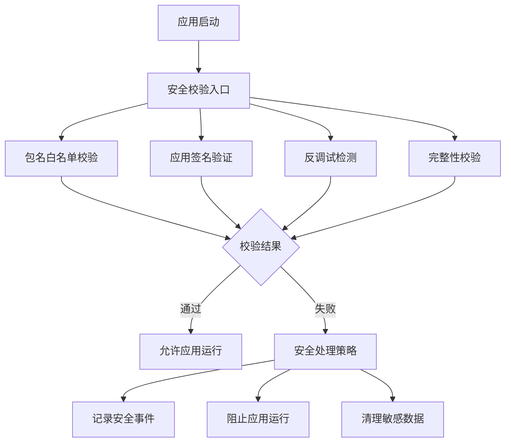

# Android NDK 安全集成指南

**版本：** v2.0.0  
**更新日期：** 2024年12月  
**适用平台：** Android NDK  
**安全等级：** 企业级

## 概述

本指南提供了 Android NDK Tools Library 安全模块的完整集成方案，包括包名白名单校验、应用签名验证、反调试检测等多层安全防护机制。所有安全功能都在原生层实现，确保最高级别的安全性。

## 安全架构

### 🛡️ 多层安全防护体系



### 🔒 安全特性

1. **包名白名单校验**：基于明文白名单的高性能包名验证
2. **应用签名验证**：防止应用被重新打包和篡改
3. **反调试检测**：检测调试器、模拟器、Root环境
4. **完整性校验**：验证应用文件的完整性
5. **运行时保护**：动态安全检查和威胁响应

## 快速集成

### 1. 基础安全集成

```kotlin
class SecureApplication : Application() {
    
    override fun onCreate() {
        super.onCreate()
        
        // 执行严格安全校验
        if (!performStrictSecurityCheck()) {
            handleSecurityFailure()
            return
        }
        
        // 继续正常的应用初始化
        initializeApp()
    }
    
    private fun performStrictSecurityCheck(): Boolean {
        return try {
            // 执行完整安全校验
            val result = Utils.performSecurityCheck(this)
            Log.i("Security", "安全校验通过: ${result.message}")
            true
        } catch (e: Utils.SecurityException) {
            Log.e("Security", "安全校验失败: ${e.message}")
            false
        }
    }
    
    private fun handleSecurityFailure() {
        // 清理敏感数据
        clearSensitiveData()
        
        // 记录安全事件
        logSecurityEvent("SECURITY_CHECK_FAILED")
        
        // 退出应用
        exitProcess(1)
    }
}
```

### 2. 分层安全校验

```kotlin
class SecurityManager {
    
    fun performLayeredSecurityCheck(context: Context): SecurityCheckResult {
        // 第一层：包名校验
        if (!checkPackageName(context)) {
            return SecurityCheckResult.PACKAGE_NOT_ALLOWED
        }
        
        // 第二层：签名验证
        if (!checkSignature(context)) {
            return SecurityCheckResult.SIGNATURE_MISMATCH
        }
        
        // 第三层：反调试检测
        if (!checkAntiDebug()) {
            return SecurityCheckResult.ANTI_DEBUG_DETECTED
        }
        
        // 第四层：完整性校验
        if (!checkIntegrity(context)) {
            return SecurityCheckResult.INTEGRITY_CHECK_FAILED
        }
        
        return SecurityCheckResult.SUCCESS
    }
    
    private fun checkPackageName(context: Context): Boolean {
        return Utils.isCurrentPackageAllowed(context)
    }
    
    private fun checkSignature(context: Context): Boolean {
        return Utils.verifyIntegrity(context)
    }
    
    private fun checkAntiDebug(): Boolean {
        return !Utils.detectAntiDebug()
    }
    
    private fun checkIntegrity(context: Context): Boolean {
        return Utils.verifyIntegrity(context)
    }
}
```

## 详细安全配置

### 包名白名单配置

#### 当前白名单配置

```cpp
// utils.cpp 中的包名白名单
static const char* PACKAGE_WHITELIST[] = {
    "me.shetj.sdk.ffmepg.demo",      // 主应用包名
    "me.shetj.sdk.ffmepg.demo.test", // 测试版本
    "me.shetj.sdk.ffmepg.demo.dev",  // 开发版本
    nullptr                           // 结束标记
};
```

#### 修改白名单配置

**步骤1：编辑源码**
```cpp
// 在 utils.cpp 中修改 PACKAGE_WHITELIST 数组
static const char* PACKAGE_WHITELIST[] = {
    "com.yourcompany.app",           // 生产环境包名
    "com.yourcompany.app.staging",   // 预发布环境
    "com.yourcompany.app.debug",     // 调试版本
    nullptr
};
```

**步骤2：重新编译**
```bash
# 重新编译 native 库
./gradlew :tools:assembleRelease
```

**步骤3：验证配置**
```kotlin
// 验证新的白名单配置
val allowedPackages = Utils.getAllowedPackages()
Log.d("Security", "允许的包名: ${allowedPackages.joinToString()}")

// 测试当前包名
val isAllowed = Utils.isCurrentPackageAllowed(context)
Log.d("Security", "当前包名是否允许: $isAllowed")
```

#### 动态白名单管理（测试环境）

```kotlin
class DynamicWhitelistManager {
    
    // 仅在测试环境使用
    fun addTestPackage(packageName: String): Boolean {
        return if (BuildConfig.DEBUG) {
            Utils.addPackageToWhitelist(packageName)
        } else {
            Log.w("Security", "动态白名单仅在调试模式下可用")
            false
        }
    }
    
    fun removeTestPackage(packageName: String): Boolean {
        return if (BuildConfig.DEBUG) {
            Utils.removePackageFromWhitelist(packageName)
        } else {
            false
        }
    }
    
    fun getCurrentWhitelist(): List<String> {
        return Utils.getAllowedPackages()
    }
}
```

### 应用签名验证配置

#### 配置发布签名

```cpp
// utils.cpp 中的发布签名配置
static const char* RELEASE_SIGN = "YOUR_RELEASE_SIGNATURE_HASH";
static const char* RELEASE_PACKAGE = "com.yourcompany.app";
```

#### 签名验证实现

```kotlin
class SignatureValidator {
    
    fun validateAppSignature(context: Context): Boolean {
        return try {
            Utils.verifyIntegrity(context)
        } catch (e: Exception) {
            Log.e("Security", "签名验证异常: ${e.message}")
            false
        }
    }
    
    fun getAppSignatureInfo(context: Context): String? {
        return try {
            val packageInfo = context.packageManager.getPackageInfo(
                context.packageName, 
                PackageManager.GET_SIGNATURES
            )
            val signature = packageInfo.signatures[0]
            val md = MessageDigest.getInstance("SHA-256")
            md.update(signature.toByteArray())
            md.digest().joinToString("") { "%02x".format(it) }
        } catch (e: Exception) {
            Log.e("Security", "获取签名信息失败: ${e.message}")
            null
        }
    }
}
```

### 反调试检测配置

#### 检测项目配置

```kotlin
class AntiDebugDetector {
    
    fun performAntiDebugCheck(): AntiDebugResult {
        val result = AntiDebugResult()
        
        // 检测调试器
        result.debuggerDetected = Utils.detectAntiDebug()
        
        // 检测模拟器环境
        result.emulatorDetected = checkEmulatorEnvironment()
        
        // 检测Root环境
        result.rootDetected = checkRootEnvironment()
        
        // 检测Xposed框架
        result.xposedDetected = checkXposedFramework()
        
        return result
    }
    
    private fun checkEmulatorEnvironment(): Boolean {
        // 通过native方法检测
        return Utils.detectAntiDebug() // 包含模拟器检测
    }
    
    private fun checkRootEnvironment(): Boolean {
        // 通过native方法检测
        return Utils.detectAntiDebug() // 包含Root检测
    }
    
    private fun checkXposedFramework(): Boolean {
        return try {
            Class.forName("de.robv.android.xposed.XposedBridge")
            true
        } catch (e: ClassNotFoundException) {
            false
        }
    }
}

data class AntiDebugResult(
    var debuggerDetected: Boolean = false,
    var emulatorDetected: Boolean = false,
    var rootDetected: Boolean = false,
    var xposedDetected: Boolean = false
) {
    val isSecure: Boolean
        get() = !debuggerDetected && !emulatorDetected && !rootDetected && !xposedDetected
}
```

#### 自定义反调试策略

```kotlin
class CustomAntiDebugStrategy {
    
    private val checkInterval = 5000L // 5秒检查一次
    private var isMonitoring = false
    
    fun startContinuousMonitoring() {
        if (isMonitoring) return
        
        isMonitoring = true
        GlobalScope.launch {
            while (isMonitoring) {
                if (Utils.detectAntiDebug()) {
                    handleDebugDetection()
                    break
                }
                delay(checkInterval)
            }
        }
    }
    
    fun stopMonitoring() {
        isMonitoring = false
    }
    
    private fun handleDebugDetection() {
        Log.w("Security", "检测到调试环境，执行安全策略")
        
        // 策略1：清理敏感数据
        clearSensitiveData()
        
        // 策略2：发送安全事件
        reportSecurityEvent("DEBUG_DETECTED")
        
        // 策略3：退出应用
        exitProcess(1)
    }
}
```

### 完整性校验配置

#### 文件完整性校验

```kotlin
class IntegrityChecker {
    
    fun verifyAppIntegrity(context: Context): IntegrityResult {
        val result = IntegrityResult()
        
        // 验证APK签名
        result.signatureValid = Utils.verifyIntegrity(context)
        
        // 验证关键文件
        result.filesValid = verifyKeyFiles(context)
        
        // 验证native库
        result.nativeLibsValid = verifyNativeLibraries(context)
        
        return result
    }
    
    private fun verifyKeyFiles(context: Context): Boolean {
        val keyFiles = listOf(
            "classes.dex",
            "AndroidManifest.xml",
            "resources.arsc"
        )
        
        return keyFiles.all { fileName ->
            verifyFileIntegrity(context, fileName)
        }
    }
    
    private fun verifyFileIntegrity(context: Context, fileName: String): Boolean {
        return try {
            val inputStream = context.assets.open(fileName)
            val hash = calculateFileHash(inputStream)
            val expectedHash = getExpectedHash(fileName)
            hash == expectedHash
        } catch (e: Exception) {
            Log.e("Security", "文件完整性校验失败: $fileName")
            false
        }
    }
    
    private fun verifyNativeLibraries(context: Context): Boolean {
        val nativeLibs = listOf("libtools.so", "libcurl.so")
        
        return nativeLibs.all { libName ->
            verifyNativeLibrary(context, libName)
        }
    }
    
    private fun calculateFileHash(inputStream: InputStream): String {
        val digest = MessageDigest.getInstance("SHA-256")
        val buffer = ByteArray(8192)
        var bytesRead: Int
        
        while (inputStream.read(buffer).also { bytesRead = it } != -1) {
            digest.update(buffer, 0, bytesRead)
        }
        
        return digest.digest().joinToString("") { "%02x".format(it) }
    }
}

data class IntegrityResult(
    var signatureValid: Boolean = false,
    var filesValid: Boolean = false,
    var nativeLibsValid: Boolean = false
) {
    val isValid: Boolean
        get() = signatureValid && filesValid && nativeLibsValid
}
```

## 高级安全特性

### 运行时安全监控

```kotlin
class RuntimeSecurityMonitor {
    
    private val securityEvents = mutableListOf<SecurityEvent>()
    private var isMonitoring = false
    
    fun startMonitoring() {
        if (isMonitoring) return
        
        isMonitoring = true
        
        // 启动周期性安全检查
        startPeriodicSecurityCheck()
        
        // 监控应用状态变化
        monitorAppStateChanges()
        
        // 监控网络状态
        monitorNetworkSecurity()
    }
    
    private fun startPeriodicSecurityCheck() {
        GlobalScope.launch {
            while (isMonitoring) {
                performRuntimeSecurityCheck()
                delay(30000) // 30秒检查一次
            }
        }
    }
    
    private fun performRuntimeSecurityCheck() {
        // 检查调试状态
        if (Utils.detectAntiDebug()) {
            recordSecurityEvent(SecurityEventType.DEBUG_DETECTED)
            handleSecurityThreat(ThreatLevel.HIGH)
        }
        
        // 检查应用完整性
        if (!Utils.verifyIntegrity(context)) {
            recordSecurityEvent(SecurityEventType.INTEGRITY_VIOLATION)
            handleSecurityThreat(ThreatLevel.CRITICAL)
        }
    }
    
    private fun recordSecurityEvent(eventType: SecurityEventType) {
        val event = SecurityEvent(
            type = eventType,
            timestamp = System.currentTimeMillis(),
            details = getEventDetails(eventType)
        )
        securityEvents.add(event)
        
        // 上报安全事件
        reportSecurityEvent(event)
    }
    
    private fun handleSecurityThreat(level: ThreatLevel) {
        when (level) {
            ThreatLevel.LOW -> {
                Log.w("Security", "检测到低级安全威胁")
            }
            ThreatLevel.MEDIUM -> {
                Log.e("Security", "检测到中级安全威胁")
                // 限制功能使用
                restrictFunctionality()
            }
            ThreatLevel.HIGH -> {
                Log.e("Security", "检测到高级安全威胁")
                // 清理敏感数据
                clearSensitiveData()
            }
            ThreatLevel.CRITICAL -> {
                Log.e("Security", "检测到严重安全威胁")
                // 立即退出应用
                exitProcess(1)
            }
        }
    }
}

enum class SecurityEventType {
    DEBUG_DETECTED,
    INTEGRITY_VIOLATION,
    UNAUTHORIZED_ACCESS,
    SUSPICIOUS_BEHAVIOR
}

enum class ThreatLevel {
    LOW, MEDIUM, HIGH, CRITICAL
}

data class SecurityEvent(
    val type: SecurityEventType,
    val timestamp: Long,
    val details: Map<String, Any>
)
```

### 数据保护和加密

```kotlin
class DataProtectionManager {
    
    private val keyAlias = "security_key"
    
    fun encryptSensitiveData(data: String): String? {
        return try {
            val cipher = getCipher()
            cipher.init(Cipher.ENCRYPT_MODE, getSecretKey())
            val encryptedBytes = cipher.doFinal(data.toByteArray())
            Base64.encodeToString(encryptedBytes, Base64.DEFAULT)
        } catch (e: Exception) {
            Log.e("Security", "数据加密失败: ${e.message}")
            null
        }
    }
    
    fun decryptSensitiveData(encryptedData: String): String? {
        return try {
            val cipher = getCipher()
            cipher.init(Cipher.DECRYPT_MODE, getSecretKey())
            val decryptedBytes = cipher.doFinal(Base64.decode(encryptedData, Base64.DEFAULT))
            String(decryptedBytes)
        } catch (e: Exception) {
            Log.e("Security", "数据解密失败: ${e.message}")
            null
        }
    }
    
    private fun getSecretKey(): SecretKey {
        val keyGenerator = KeyGenerator.getInstance(KeyProperties.KEY_ALGORITHM_AES, "AndroidKeyStore")
        val keyGenParameterSpec = KeyGenParameterSpec.Builder(
            keyAlias,
            KeyProperties.PURPOSE_ENCRYPT or KeyProperties.PURPOSE_DECRYPT
        )
            .setBlockModes(KeyProperties.BLOCK_MODE_GCM)
            .setEncryptionPaddings(KeyProperties.ENCRYPTION_PADDING_NONE)
            .build()
        
        keyGenerator.init(keyGenParameterSpec)
        return keyGenerator.generateKey()
    }
    
    private fun getCipher(): Cipher {
        return Cipher.getInstance("AES/GCM/NoPadding")
    }
    
    fun clearSensitiveData() {
        // 清理内存中的敏感数据
        System.gc()
        
        // 删除临时文件
        clearTempFiles()
        
        // 清理SharedPreferences中的敏感数据
        clearSensitivePreferences()
    }
}
```

### 网络安全配置

```kotlin
class NetworkSecurityConfig {
    
    fun configureSecureNetworking() {
        // 配置证书锁定
        configureCertificatePinning()
        
        // 配置安全传输
        configureSecureTransport()
        
        // 配置请求验证
        configureRequestValidation()
    }
    
    private fun configureCertificatePinning() {
        val certificatePinner = CertificatePinner.Builder()
            .add("api.yourcompany.com", "sha256/AAAAAAAAAAAAAAAAAAAAAAAAAAAAAAAAAAAAAAAAAAA=")
            .add("api.yourcompany.com", "sha256/BBBBBBBBBBBBBBBBBBBBBBBBBBBBBBBBBBBBBBBBBBB=")
            .build()
        
        // 应用到HTTP客户端
        CurlHttp.setCertificatePinner(certificatePinner)
    }
    
    private fun configureSecureTransport() {
        // 启用TLS 1.3
        CurlHttp.setMinTLSVersion("1.3")
        
        // 配置安全密码套件
        CurlHttp.setCipherSuites(listOf(
            "TLS_AES_256_GCM_SHA384",
            "TLS_CHACHA20_POLY1305_SHA256",
            "TLS_AES_128_GCM_SHA256"
        ))
    }
    
    private fun configureRequestValidation() {
        // 添加请求签名验证
        CurlHttp.addRequestInterceptor { request ->
            val signature = generateRequestSignature(request)
            request.copy(
                headers = request.headers + ("X-Request-Signature" to signature)
            )
        }
    }
    
    private fun generateRequestSignature(request: HttpRequest): String {
        val data = "${request.method}${request.url}${request.body ?: ""}"
        return hmacSha256(data, getApiSecret())
    }
}
```

## 安全测试和验证

### 安全测试套件

```kotlin
class SecurityTestSuite {
    
    fun runAllSecurityTests(context: Context): SecurityTestResult {
        val result = SecurityTestResult()
        
        // 测试包名校验
        result.packageNameTest = testPackageNameValidation(context)
        
        // 测试签名验证
        result.signatureTest = testSignatureValidation(context)
        
        // 测试反调试检测
        result.antiDebugTest = testAntiDebugDetection()
        
        // 测试完整性校验
        result.integrityTest = testIntegrityValidation(context)
        
        // 测试数据保护
        result.dataProtectionTest = testDataProtection()
        
        return result
    }
    
    private fun testPackageNameValidation(context: Context): TestResult {
        return try {
            // 测试当前包名
            val currentAllowed = Utils.isCurrentPackageAllowed(context)
            
            // 测试已知允许的包名
            val knownAllowed = Utils.isPackageAllowed("me.shetj.sdk.ffmepg.demo")
            
            // 测试不允许的包名
            val notAllowed = Utils.isPackageAllowed("com.malicious.app")
            
            TestResult(
                passed = currentAllowed && knownAllowed && !notAllowed,
                message = "包名校验测试完成"
            )
        } catch (e: Exception) {
            TestResult(false, "包名校验测试失败: ${e.message}")
        }
    }
    
    private fun testSignatureValidation(context: Context): TestResult {
        return try {
            val isValid = Utils.verifyIntegrity(context)
            TestResult(isValid, "签名验证测试: ${if (isValid) "通过" else "失败"}")
        } catch (e: Exception) {
            TestResult(false, "签名验证测试异常: ${e.message}")
        }
    }
    
    private fun testAntiDebugDetection(): TestResult {
        return try {
            val debugDetected = Utils.detectAntiDebug()
            TestResult(
                passed = true, // 测试本身成功
                message = "反调试检测: ${if (debugDetected) "检测到调试环境" else "环境安全"}"
            )
        } catch (e: Exception) {
            TestResult(false, "反调试检测测试失败: ${e.message}")
        }
    }
}

data class SecurityTestResult(
    var packageNameTest: TestResult = TestResult(),
    var signatureTest: TestResult = TestResult(),
    var antiDebugTest: TestResult = TestResult(),
    var integrityTest: TestResult = TestResult(),
    var dataProtectionTest: TestResult = TestResult()
) {
    val allPassed: Boolean
        get() = packageNameTest.passed && signatureTest.passed && 
                antiDebugTest.passed && integrityTest.passed && 
                dataProtectionTest.passed
}

data class TestResult(
    val passed: Boolean = false,
    val message: String = ""
)
```

### 安全审计和日志

```kotlin
class SecurityAuditLogger {
    
    private val auditLog = mutableListOf<AuditEntry>()
    
    fun logSecurityEvent(event: SecurityEvent) {
        val entry = AuditEntry(
            timestamp = System.currentTimeMillis(),
            eventType = event.type.name,
            severity = getSeverity(event.type),
            details = event.details,
            deviceInfo = getDeviceInfo()
        )
        
        auditLog.add(entry)
        
        // 写入本地日志文件
        writeToLogFile(entry)
        
        // 如果是严重事件，立即上报
        if (entry.severity == Severity.CRITICAL) {
            reportCriticalEvent(entry)
        }
    }
    
    fun generateSecurityReport(): SecurityReport {
        val now = System.currentTimeMillis()
        val last24Hours = now - 24 * 60 * 60 * 1000
        
        val recentEvents = auditLog.filter { it.timestamp >= last24Hours }
        
        return SecurityReport(
            generatedAt = now,
            totalEvents = recentEvents.size,
            criticalEvents = recentEvents.count { it.severity == Severity.CRITICAL },
            highEvents = recentEvents.count { it.severity == Severity.HIGH },
            mediumEvents = recentEvents.count { it.severity == Severity.MEDIUM },
            lowEvents = recentEvents.count { it.severity == Severity.LOW },
            events = recentEvents
        )
    }
    
    private fun getSeverity(eventType: SecurityEventType): Severity {
        return when (eventType) {
            SecurityEventType.DEBUG_DETECTED -> Severity.HIGH
            SecurityEventType.INTEGRITY_VIOLATION -> Severity.CRITICAL
            SecurityEventType.UNAUTHORIZED_ACCESS -> Severity.HIGH
            SecurityEventType.SUSPICIOUS_BEHAVIOR -> Severity.MEDIUM
        }
    }
}

data class AuditEntry(
    val timestamp: Long,
    val eventType: String,
    val severity: Severity,
    val details: Map<String, Any>,
    val deviceInfo: Map<String, String>
)

enum class Severity {
    LOW, MEDIUM, HIGH, CRITICAL
}

data class SecurityReport(
    val generatedAt: Long,
    val totalEvents: Int,
    val criticalEvents: Int,
    val highEvents: Int,
    val mediumEvents: Int,
    val lowEvents: Int,
    val events: List<AuditEntry>
)
```

## 部署和维护

### 生产环境部署清单

#### 部署前检查

- [ ] **包名白名单配置**：确认生产环境包名已添加到白名单
- [ ] **签名配置**：验证发布签名哈希值正确配置
- [ ] **调试代码移除**：确保所有调试相关代码已移除
- [ ] **日志级别**：设置生产环境日志级别
- [ ] **安全测试**：执行完整的安全测试套件
- [ ] **性能测试**：验证安全功能对性能的影响
- [ ] **兼容性测试**：在目标设备上测试安全功能

#### 配置文件模板

```kotlin
// SecurityConfig.kt - 生产环境配置
object SecurityConfig {
    
    // 生产环境配置
    const val ENABLE_STRICT_SECURITY = true
    const val ENABLE_RUNTIME_MONITORING = true
    const val ENABLE_SECURITY_LOGGING = true
    
    // 安全检查间隔（毫秒）
    const val SECURITY_CHECK_INTERVAL = 30000L
    
    // 威胁响应配置
    const val AUTO_EXIT_ON_THREAT = true
    const val CLEAR_DATA_ON_THREAT = true
    
    // 日志配置
    const val MAX_LOG_ENTRIES = 1000
    const val LOG_RETENTION_DAYS = 7
    
    fun getSecurityLevel(): SecurityLevel {
        return if (BuildConfig.DEBUG) {
            SecurityLevel.DEVELOPMENT
        } else {
            SecurityLevel.PRODUCTION
        }
    }
}

enum class SecurityLevel {
    DEVELOPMENT,    // 开发环境：宽松的安全策略
    STAGING,        // 预发布环境：中等安全策略
    PRODUCTION      // 生产环境：严格的安全策略
}
```

### 监控和维护

#### 安全监控仪表板

```kotlin
class SecurityDashboard {
    
    fun getSecurityMetrics(): SecurityMetrics {
        return SecurityMetrics(
            totalSecurityChecks = getTotalSecurityChecks(),
            successfulChecks = getSuccessfulChecks(),
            failedChecks = getFailedChecks(),
            threatDetections = getThreatDetections(),
            lastCheckTime = getLastCheckTime(),
            systemHealth = getSystemHealth()
        )
    }
    
    fun generateHealthReport(): HealthReport {
        val metrics = getSecurityMetrics()
        
        return HealthReport(
            overallHealth = calculateOverallHealth(metrics),
            recommendations = generateRecommendations(metrics),
            alerts = getActiveAlerts(),
            trends = getSecurityTrends()
        )
    }
    
    private fun calculateOverallHealth(metrics: SecurityMetrics): HealthStatus {
        val successRate = metrics.successfulChecks.toFloat() / metrics.totalSecurityChecks
        
        return when {
            successRate >= 0.95 -> HealthStatus.EXCELLENT
            successRate >= 0.90 -> HealthStatus.GOOD
            successRate >= 0.80 -> HealthStatus.FAIR
            else -> HealthStatus.POOR
        }
    }
}

data class SecurityMetrics(
    val totalSecurityChecks: Long,
    val successfulChecks: Long,
    val failedChecks: Long,
    val threatDetections: Long,
    val lastCheckTime: Long,
    val systemHealth: HealthStatus
)

enum class HealthStatus {
    EXCELLENT, GOOD, FAIR, POOR
}
```

## 故障排除

### 常见问题和解决方案

#### 1. 包名校验失败

**问题**：应用启动时提示包名不在白名单中

**解决方案**：
```kotlin
// 检查当前包名
val currentPackage = context.packageName
Log.d("Debug", "当前包名: $currentPackage")

// 检查白名单
val allowedPackages = Utils.getAllowedPackages()
Log.d("Debug", "允许的包名: ${allowedPackages.joinToString()}")

// 如果包名不匹配，需要更新白名单配置
```

#### 2. 签名验证失败

**问题**：签名验证不通过

**解决方案**：
```kotlin
// 获取当前签名信息
val signatureInfo = SignatureValidator().getAppSignatureInfo(context)
Log.d("Debug", "当前签名: $signatureInfo")

// 检查配置的发布签名
// 需要在 utils.cpp 中更新 RELEASE_SIGN 常量
```

#### 3. 反调试误报

**问题**：在正常环境下误报调试检测

**解决方案**：
```kotlin
// 分步检查反调试检测
val antiDebugResult = AntiDebugDetector().performAntiDebugCheck()
Log.d("Debug", "调试器检测: ${antiDebugResult.debuggerDetected}")
Log.d("Debug", "模拟器检测: ${antiDebugResult.emulatorDetected}")
Log.d("Debug", "Root检测: ${antiDebugResult.rootDetected}")

// 根据具体检测结果调整策略
```

### 调试工具

```kotlin
class SecurityDebugTools {
    
    fun dumpSecurityStatus(context: Context) {
        Log.d("SecurityDebug", "=== 安全状态诊断 ===")
        
        // 包名信息
        Log.d("SecurityDebug", "当前包名: ${context.packageName}")
        Log.d("SecurityDebug", "包名校验: ${Utils.isCurrentPackageAllowed(context)}")
        
        // 签名信息
        Log.d("SecurityDebug", "签名验证: ${Utils.verifyIntegrity(context)}")
        
        // 反调试信息
        Log.d("SecurityDebug", "反调试检测: ${Utils.detectAntiDebug()}")
        
        // 白名单信息
        val whitelist = Utils.getAllowedPackages()
        Log.d("SecurityDebug", "白名单: ${whitelist.joinToString()}")
        
        // 设备信息
        Log.d("SecurityDebug", "设备型号: ${Build.MODEL}")
        Log.d("SecurityDebug", "Android版本: ${Build.VERSION.RELEASE}")
        Log.d("SecurityDebug", "API级别: ${Build.VERSION.SDK_INT}")
    }
    
    fun testSecurityComponents(context: Context) {
        val testSuite = SecurityTestSuite()
        val result = testSuite.runAllSecurityTests(context)
        
        Log.d("SecurityTest", "包名测试: ${result.packageNameTest}")
        Log.d("SecurityTest", "签名测试: ${result.signatureTest}")
        Log.d("SecurityTest", "反调试测试: ${result.antiDebugTest}")
        Log.d("SecurityTest", "完整性测试: ${result.integrityTest}")
        Log.d("SecurityTest", "数据保护测试: ${result.dataProtectionTest}")
        Log.d("SecurityTest", "整体结果: ${if (result.allPassed) "通过" else "失败"}")
    }
}
```

## 最佳实践

### 1. 安全开发生命周期

```kotlin
class SecureDevLifecycle {
    
    // 开发阶段
    fun developmentPhase() {
        // 使用宽松的安全策略
        // 启用详细的安全日志
        // 允许动态白名单管理
    }
    
    // 测试阶段
    fun testingPhase() {
        // 执行完整的安全测试
        // 验证所有安全功能
        // 性能影响评估
    }
    
    // 预发布阶段
    fun stagingPhase() {
        // 使用生产级安全配置
        // 禁用调试功能
        // 验证签名和包名配置
    }
    
    // 生产阶段
    fun productionPhase() {
        // 启用最严格的安全策略
        // 启用运行时监控
        // 配置安全事件上报
    }
}
```

### 2. 性能优化建议

```kotlin
class SecurityPerformanceOptimizer {
    
    fun optimizeSecurityChecks() {
        // 1. 合理设置检查频率
        setSecurityCheckInterval(30000) // 30秒
        
        // 2. 使用缓存减少重复检查
        enableSecurityCheckCache(true)
        
        // 3. 异步执行非关键检查
        enableAsyncSecurityChecks(true)
        
        // 4. 根据威胁级别调整检查强度
        setAdaptiveSecurityLevel(true)
    }
    
    fun monitorPerformanceImpact() {
        // 监控安全功能对应用性能的影响
        val metrics = SecurityMetrics.getPerformanceMetrics()
        
        if (metrics.averageCheckTime > 100) { // 100ms
            Log.w("Performance", "安全检查耗时过长，考虑优化")
        }
        
        if (metrics.memoryUsage > 10 * 1024 * 1024) { // 10MB
            Log.w("Performance", "安全功能内存使用过高")
        }
    }
}
```

### 3. 安全事件响应

```kotlin
class SecurityIncidentResponse {
    
    fun handleSecurityIncident(incident: SecurityIncident) {
        // 1. 立即响应
        immediateResponse(incident)
        
        // 2. 评估威胁级别
        val threatLevel = assessThreatLevel(incident)
        
        // 3. 执行响应策略
        executeResponseStrategy(threatLevel)
        
        // 4. 记录和上报
        logAndReport(incident)
        
        // 5. 后续跟踪
        scheduleFollowUp(incident)
    }
    
    private fun immediateResponse(incident: SecurityIncident) {
        when (incident.type) {
            IncidentType.INTEGRITY_VIOLATION -> {
                // 立即停止应用运行
                exitProcess(1)
            }
            IncidentType.DEBUG_DETECTED -> {
                // 清理敏感数据
                clearSensitiveData()
            }
            IncidentType.UNAUTHORIZED_ACCESS -> {
                // 撤销访问权限
                revokeAccess()
            }
        }
    }
}
```

## 合规性和标准

### 安全标准遵循

本安全集成指南遵循以下安全标准和最佳实践：

- **OWASP Mobile Top 10**：移动应用安全风险防护
- **NIST Cybersecurity Framework**：网络安全框架
- **ISO 27001**：信息安全管理体系
- **Android Security Best Practices**：Android安全最佳实践

### 隐私保护

```kotlin
class PrivacyProtectionManager {
    
    fun handlePersonalData(data: PersonalData) {
        // 1. 数据最小化原则
        val minimizedData = minimizeData(data)
        
        // 2. 加密存储
        val encryptedData = encryptData(minimizedData)
        
        // 3. 访问控制
        enforceAccessControl(encryptedData)
        
        // 4. 审计日志
        logDataAccess(data.type)
    }
    
    fun handleDataDeletion(userId: String) {
        // 实现数据删除权
        deleteUserData(userId)
        
        // 清理缓存
        clearUserCache(userId)
        
        // 记录删除操作
        logDataDeletion(userId)
    }
}
```

## 版本更新和迁移

### v2.0.0 迁移指南

#### 从v1.0.0升级到v2.0.0

**重大变更：**
1. **XOR加密算法移除**：替换为明文包名白名单算法
2. **API接口更新**：新增多个安全校验方法
3. **配置格式变更**：包名白名单配置方式改变

**迁移步骤：**

```kotlin
// 1. 更新包名白名单配置
// 旧版本（v1.0.0）- 不再使用
// val encryptedWhitelist = Utils.getEncryptedWhitelist()

// 新版本（v2.0.0）
val plainWhitelist = Utils.getAllowedPackages()

// 2. 更新安全校验调用
// 旧版本
// val isSecure = Utils.basicSecurityCheck(context)

// 新版本
val result = Utils.performSecurityCheck(context)
// 或使用安全版本
val safeResult = Utils.performSecurityCheckSafe(context)

// 3. 更新错误处理
try {
    Utils.performSecurityCheck(context)
} catch (e: Utils.SecurityException) {
    handleSecurityFailure(e.result)
}
```

## 技术支持

### 获取帮助

如果在安全集成过程中遇到问题：

1. **查阅文档**：仔细阅读本指南的相关章节
2. **检查日志**：启用详细日志获取错误信息
3. **运行诊断**：使用SecurityDebugTools进行诊断
4. **安全测试**：执行SecurityTestSuite验证配置
5. **联系支持**：提供详细的错误信息和环境描述

### 安全报告

如果发现安全漏洞，请通过安全渠道报告：

- **邮箱**：security@yourcompany.com
- **加密通信**：使用PGP加密敏感信息
- **响应时间**：我们将在24小时内响应安全报告

---

**⚠️ 重要提醒：**

1. **定期更新**：及时更新安全库到最新版本
2. **配置验证**：部署前务必验证所有安全配置
3. **监控告警**：建立完善的安全监控和告警机制
4. **应急预案**：制定安全事件应急响应预案
5. **培训教育**：定期进行安全意识培训

*本指南将持续更新，以应对不断变化的安全威胁。请定期检查更新。*